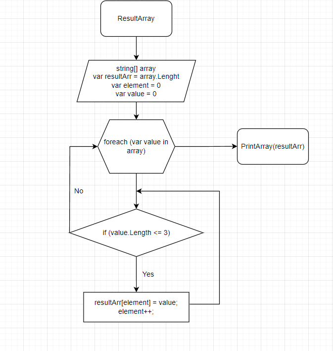

# Итоговая контрольная работа по основному блоку
## Необходимо:
1. Создать репозиторий на GitHub
2. Нарисовать блок-схему алгоритма (можно обойтись блок-схемой основной содержательной части, если вы выделяете её в отдельный метод)
3. Снабдить репозиторий оформленным текстовым описанием решения (файл README.md)
4. Написать программу, решающую поставленную задачу
5. Использовать контроль версий в работе над этим небольшим проектом (не должно быть так, что всё залито одним коммитом, как минимум этапы 2, 3, и 4 должны быть расположены в разных коммитах)
### Задача:
Написать программу, которая из имеющегося массива строк формирует новый массив из строк, длина которых меньше, либо равна 3 символам. Первоначальный массив можно ввести с клавиатуры, либо задать на старте выполнения алгоритма. При решении не рекомендуется пользоваться коллекциями, лучше обойтись исключительно массивами.

Примеры:
+ [“Hello”, “2”, “world”, “:-)”] → [“2”, “:-)”]
+ [“1234”, “1567”, “-2”, “computer science”] → [“-2”]
+ [“Russia”, “Denmark”, “Kazan”] → []

# Описание решения проекта
1. Создаем метод *ResultArray*, который принимает массив строк
2. Внутри метода инициализируем результирующий массив *resultArr* и присваиваем ему размер входного массива
3. Инициализируем переменную *element*, которая будет являться индексом массива *resultArr* и присваиваем ей нулевое значение
4. Циклом **foreach** начинаем обход элементов переданного массива
5. Создаем условие для искомых элементов, - если длина строки элемента менее трёх символов или равна трём, то присваиваем массиву *resultArr* этот элемент под индексом *element*
6. После завершения цикла, передаем результирующий массив методу *PrintArray*, для вывода искомых элементов на печать

## Блок-схема основной содержательной части алгоритма:
